# Bong Lem Campaign Business Analytics Report

Generated on: 2026-04-19 14:24:28

## 1) Executive KPI Snapshot

| Metric | Value |
| --- | --- |
| Campaign period | 2026-02-25 to 2026-04-19 |
| Total visitors | 520 |
| Total page views | 714 |
| Views per visitor | 1.37 |
| Orders | 118 |
| Completed orders | 73 |
| Paid orders | 35 |
| Visitor -> completed order | 14.04% |
| Completion rate | 61.9% |
| Paid rate | 29.7% |
| GMV (all orders) | 6,017,000 VND |
| GMV (completed orders) | 3,837,000 VND |
| AOV (completed) | 52,562 VND |
| Revenue / visitor | 7,379 VND |
| Unique customers | 70 |
| Returning customers | 36 |
| Returning customer rate | 51.4% |
| Repeat orders | 48 |
| Returning customer GMV share | 81.9% |
| Average orders / customer | 1.69 |

## 2) Key Business Insights

- The website generated 520 visitors and 714 page views over 54 tracked days.
- Engagement depth was 1.37 views per visitor, which means many visitors viewed only one page before leaving.
- The best traffic week was Week 3 (Mar 11 - Mar 17) with 215 visitors.
- The best revenue week was Week 3 (Mar 11 - Mar 17) with 1,176,000 VND completed GMV.
- Estimated visitor-to-completed-order conversion was 14.04%.
- Only 29.7% of campaign orders were marked paid, so payment follow-up is a major operational lever.
- Returning customers are meaningful: 36 of 70 customers ordered more than once (51.4%).
- Repeat orders made up 40.7% of all orders, and returning customers contributed 81.9% of completed GMV.
- Latest-week traffic decreased by 58.5% versus the previous week, so weekly monitoring is needed instead of end-period review only.
- After cleaning similar referral links, Facebook is the largest known acquisition channel with 74.9% of referral visitors.
- The audience is concentrated in VN with 90.5% of known visitors.
- Mobile is the default user experience because it contributes 57.3% of known visitors.

## 3) Weekly Performance Tracking

| Week | Period | Visitors | Page views | Views/visitor | Orders | Completed orders | Paid orders | Completed GMV | Completion rate | Paid rate | Visitor->completed | Revenue/visitor | WoW visitors | WoW completed GMV |
| --- | --- | --- | --- | --- | --- | --- | --- | --- | --- | --- | --- | --- | --- | --- |
| 1 | Feb 25 - Mar 03 | 51 | 83 | 1.63 | 0 | 0 | 0 | 0 VND | 0.0% | 0.0% | 0.0% | 0 VND | - | - |
| 2 | Mar 04 - Mar 10 | 25 | 31 | 1.24 | 0 | 0 | 0 | 0 VND | 0.0% | 0.0% | 0.0% | 0 VND | -51.0% | - |
| 3 | Mar 11 - Mar 17 | 215 | 312 | 1.45 | 50 | 25 | 2 | 1,176,000 VND | 50.0% | 4.0% | 11.6% | 5,470 VND | 760.0% | - |
| 4 | Mar 18 - Mar 24 | 66 | 91 | 1.38 | 22 | 12 | 5 | 625,000 VND | 54.5% | 22.7% | 18.2% | 9,470 VND | -69.3% | -46.9% |
| 5 | Mar 25 - Mar 31 | 49 | 62 | 1.27 | 20 | 14 | 7 | 673,000 VND | 70.0% | 35.0% | 28.6% | 13,735 VND | -25.8% | 7.7% |
| 6 | Apr 01 - Apr 07 | 56 | 70 | 1.25 | 14 | 12 | 11 | 737,000 VND | 85.7% | 78.6% | 21.4% | 13,161 VND | 14.3% | 9.5% |
| 7 | Apr 08 - Apr 14 | 41 | 46 | 1.12 | 10 | 8 | 8 | 526,000 VND | 80.0% | 80.0% | 19.5% | 12,829 VND | -26.8% | -28.6% |
| 8 | Apr 15 - Apr 19 | 17 | 19 | 1.12 | 2 | 2 | 2 | 100,000 VND | 100.0% | 100.0% | 11.8% | 5,882 VND | -58.5% | -81.0% |

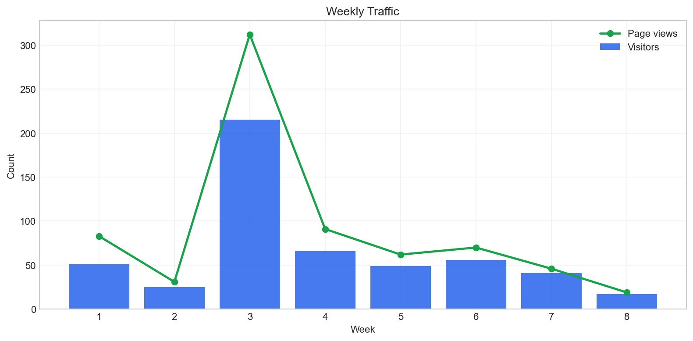

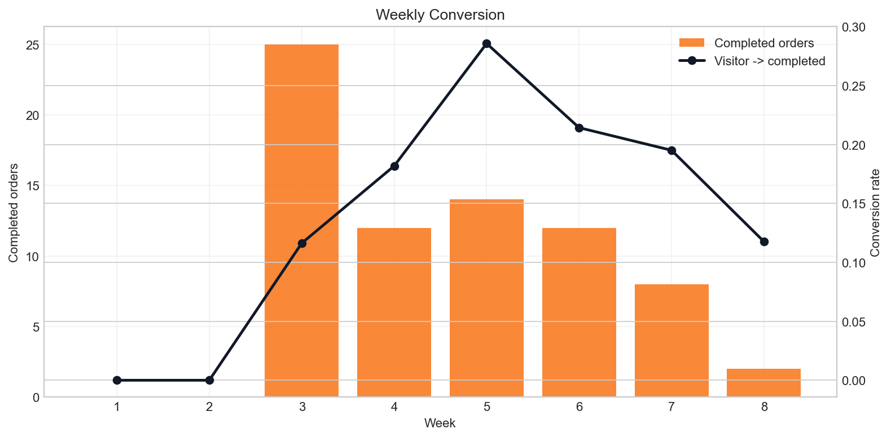

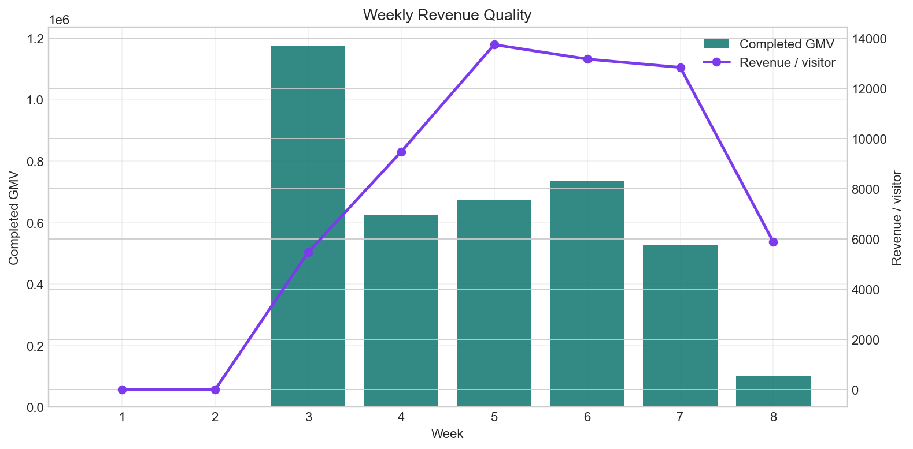

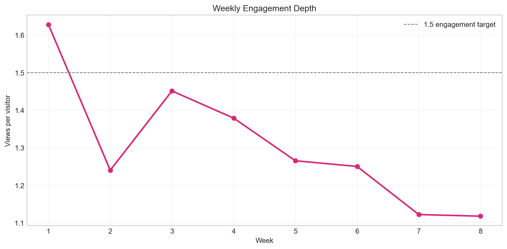

### Weekly Increase/Decrease Alerts

| Week | Period | Visitors | Completed orders | Completed GMV | WoW visitors | WoW completed GMV | Traffic signal | Revenue signal |
| --- | --- | --- | --- | --- | --- | --- | --- | --- |
| 1 | Feb 25 - Mar 03 | 51 | 0 | 0 VND | - | - | Baseline | Baseline |
| 2 | Mar 04 - Mar 10 | 25 | 0 | 0 VND | -51.0% | - | Decrease | Baseline |
| 3 | Mar 11 - Mar 17 | 215 | 25 | 1,176,000 VND | 760.0% | - | Increase | Baseline |
| 4 | Mar 18 - Mar 24 | 66 | 12 | 625,000 VND | -69.3% | -46.9% | Decrease | Decrease |
| 5 | Mar 25 - Mar 31 | 49 | 14 | 673,000 VND | -25.8% | 7.7% | Decrease | Stable |
| 6 | Apr 01 - Apr 07 | 56 | 12 | 737,000 VND | 14.3% | 9.5% | Stable | Stable |
| 7 | Apr 08 - Apr 14 | 41 | 8 | 526,000 VND | -26.8% | -28.6% | Decrease | Decrease |
| 8 | Apr 15 - Apr 19 | 17 | 2 | 100,000 VND | -58.5% | -81.0% | Decrease | Decrease |

## 4) Daily Traffic and Order Behavior

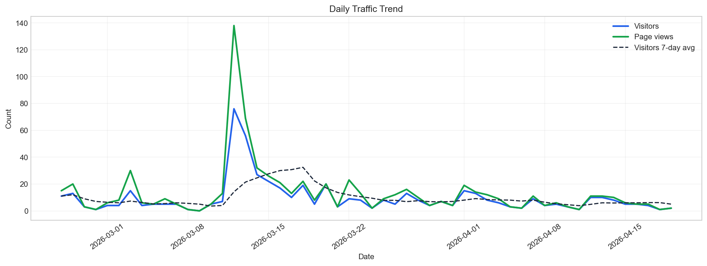

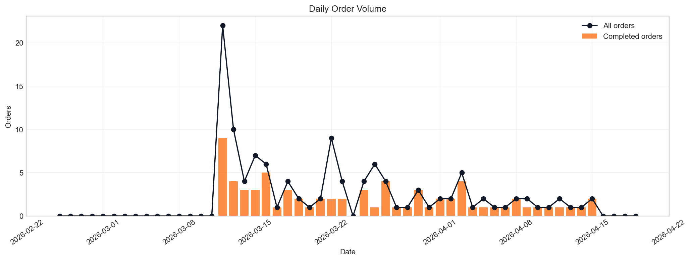

### Top Traffic Days

| date | visitors | page_views | Orders | CompletedOrders | CompletedGMV | RevenuePerVisitor |
| --- | --- | --- | --- | --- | --- | --- |
| 2026-03-12 | 76 | 138 | 22 | 9 | 437,000 VND | 5,750 VND |
| 2026-03-13 | 56 | 69 | 10 | 4 | 95,000 VND | 1,696 VND |
| 2026-03-14 | 27 | 32 | 4 | 3 | 246,000 VND | 9,111 VND |
| 2026-03-15 | 22 | 26 | 7 | 3 | 86,000 VND | 3,909 VND |
| 2026-03-20 | 20 | 20 | 1 | 1 | 150,000 VND | 7,500 VND |
| 2026-03-18 | 19 | 22 | 4 | 3 | 118,000 VND | 6,211 VND |
| 2026-03-16 | 17 | 21 | 6 | 5 | 167,000 VND | 9,824 VND |
| 2026-03-03 | 15 | 30 | 0 | 0 | 0 VND | 0 VND |
| 2026-04-01 | 15 | 19 | 2 | 2 | 147,000 VND | 9,800 VND |
| 2026-02-26 | 13 | 20 | 0 | 0 | 0 VND | 0 VND |

## 5) Cleaned Referral and Acquisition Analysis

Similar referral links were cleaned into canonical sources. For example, `m.facebook.com`, `l.facebook.com`, `lm.facebook.com`, and `facebook.com` are counted together as `facebook.com`.

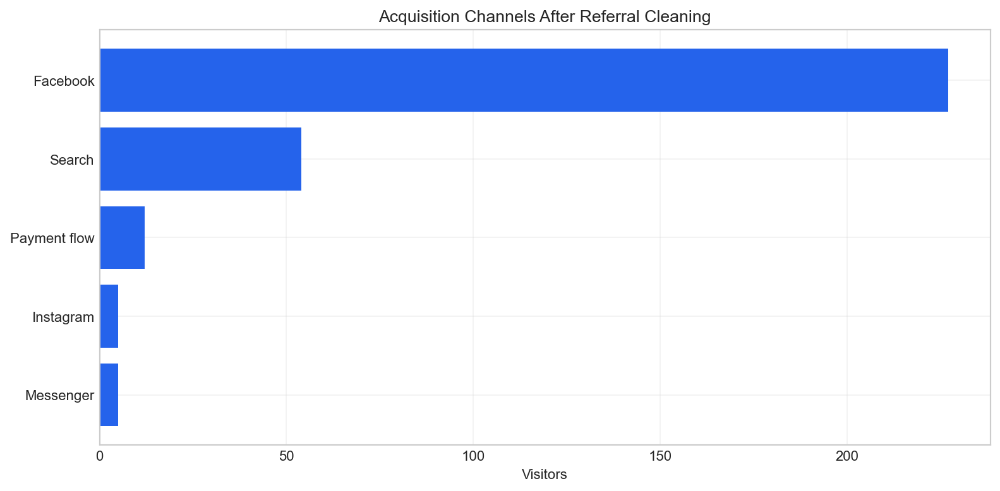

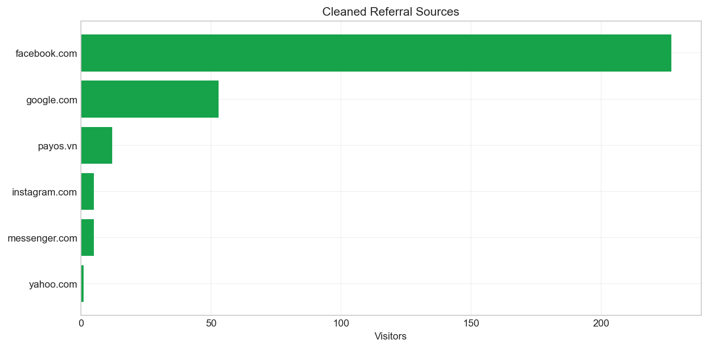

### Raw Referral Cleanup Mapping

| Referrer | CleanReferrer | Channel | Visitors | Total |
| --- | --- | --- | --- | --- |
| m.facebook.com | facebook.com | Facebook | 106 | 124 |
| l.facebook.com | facebook.com | Facebook | 79 | 93 |
| google.com | google.com | Search | 53 | 76 |
| lm.facebook.com | facebook.com | Facebook | 27 | 32 |
| facebook.com | facebook.com | Facebook | 15 | 16 |
| pay.payos.vn | payos.vn | Payment flow | 12 | 14 |
| l.messenger.com | messenger.com | Messenger | 5 | 9 |
| l.instagram.com | instagram.com | Instagram | 5 | 7 |
| vn.search.yahoo.com | yahoo.com | Search | 1 | 1 |

### Cleaned Referral Sources

| CleanReferrer | Channel | Visitors | VisitorShare | Total | RawLinks |
| --- | --- | --- | --- | --- | --- |
| facebook.com | Facebook | 227 | 74.9% | 265 | facebook.com, l.facebook.com, lm.facebook.com, m.facebook.com |
| google.com | Search | 53 | 17.5% | 76 | google.com |
| payos.vn | Payment flow | 12 | 4.0% | 14 | pay.payos.vn |
| messenger.com | Messenger | 5 | 1.7% | 9 | l.messenger.com |
| instagram.com | Instagram | 5 | 1.7% | 7 | l.instagram.com |
| yahoo.com | Search | 1 | 0.3% | 1 | vn.search.yahoo.com |

### Acquisition Channels

| Channel | Visitors | VisitorShare | Total | Sources |
| --- | --- | --- | --- | --- |
| Facebook | 227 | 74.9% | 265 | facebook.com |
| Search | 54 | 17.8% | 77 | google.com, yahoo.com |
| Payment flow | 12 | 4.0% | 14 | payos.vn |
| Messenger | 5 | 1.7% | 9 | messenger.com |
| Instagram | 5 | 1.7% | 7 | instagram.com |

## 6) Audience Segmentation

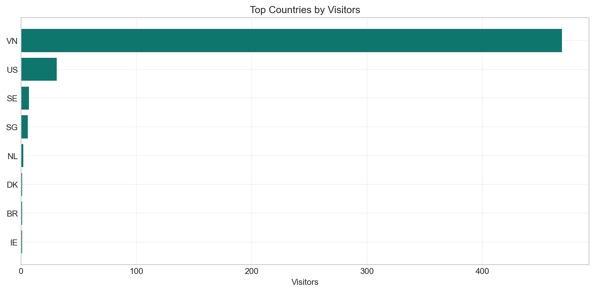

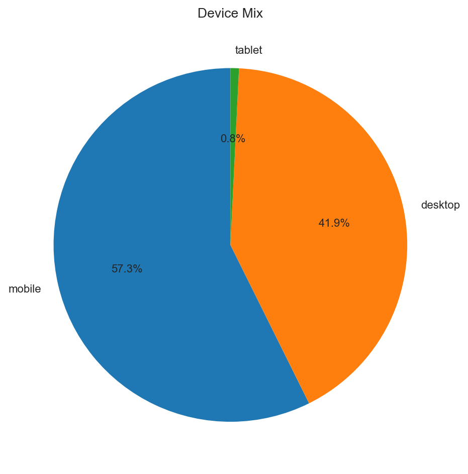

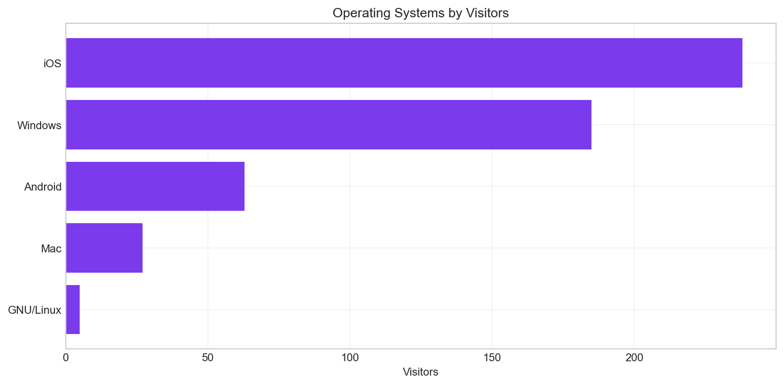

### Countries

| Country | Visitors | Total | VisitorShare |
| --- | --- | --- | --- |
| VN | 469 | 642 | 90.5% |
| US | 31 | 34 | 6.0% |
| SG | 6 | 15 | 1.2% |
| SE | 7 | 10 | 1.4% |
| DK | 1 | 10 | 0.2% |
| NL | 2 | 2 | 0.4% |
| IE | 1 | 1 | 0.2% |
| BR | 1 | 1 | 0.2% |

### Devices

| Device | Visitors | Total | VisitorShare |
| --- | --- | --- | --- |
| mobile | 297 | 406 | 57.3% |
| desktop | 217 | 305 | 41.9% |
| tablet | 4 | 4 | 0.8% |

### Operating Systems

| OperatingSystem | Visitors | Total | VisitorShare |
| --- | --- | --- | --- |
| iOS | 238 | 326 | 45.9% |
| Windows | 185 | 255 | 35.7% |
| Android | 63 | 84 | 12.2% |
| Mac | 27 | 45 | 5.2% |
| GNU/Linux | 5 | 5 | 1.0% |

## 7) Returning Customer Analysis

Returning customers are identified inside the campaign order data using phone number first, then email, Facebook link, and name as fallback identifiers. The report uses anonymized customer IDs only.

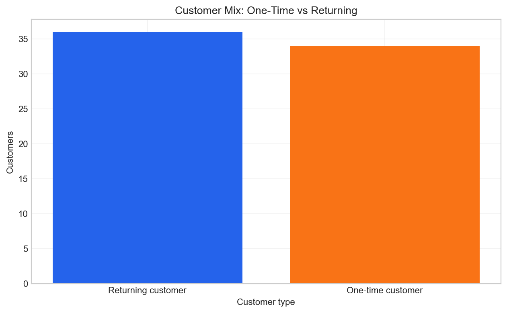

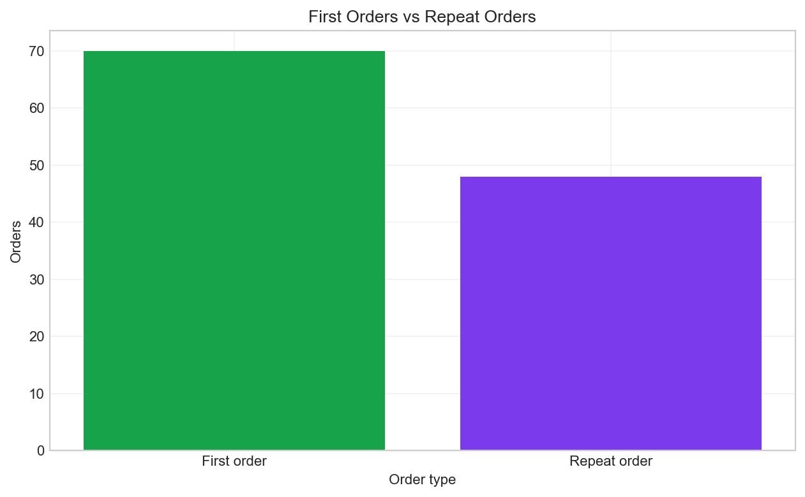

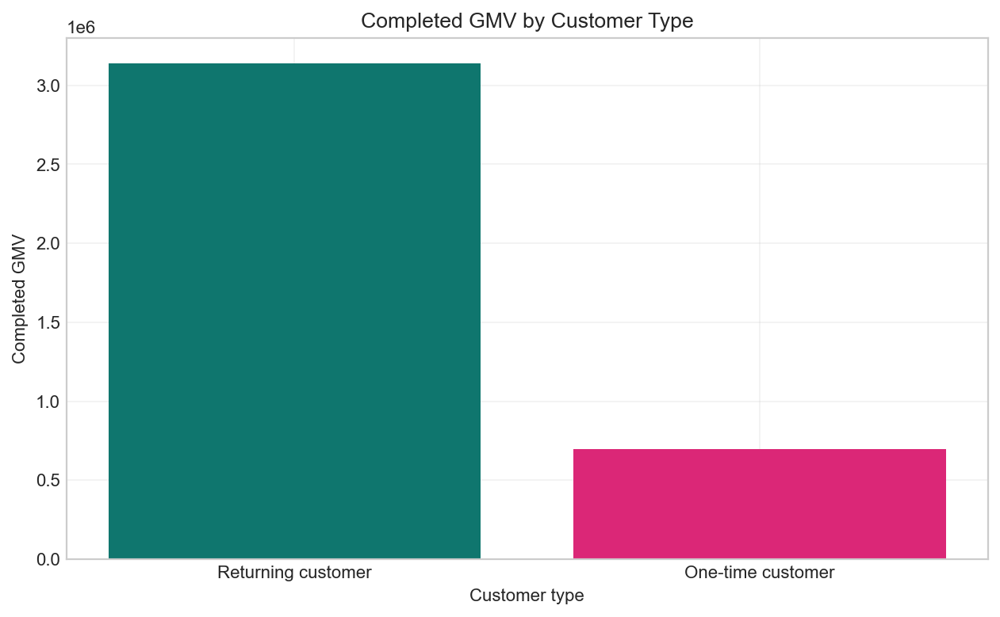

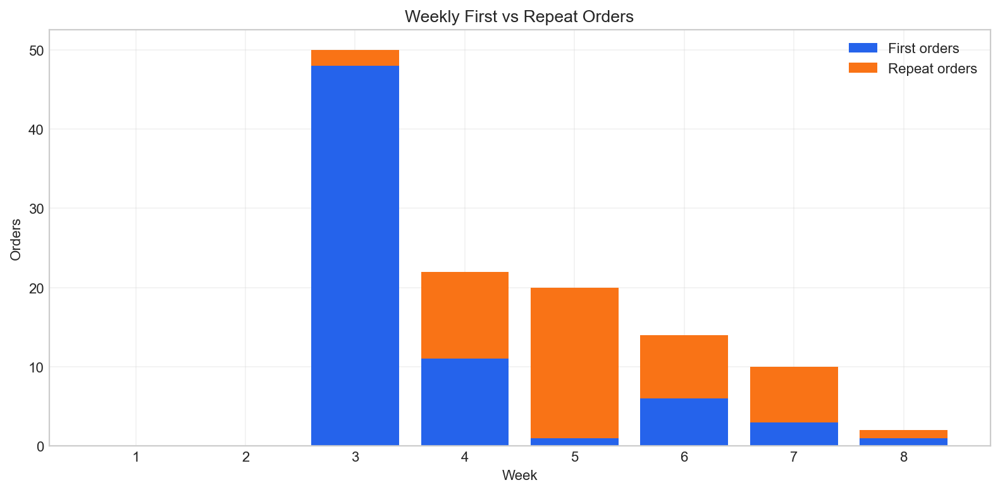

### Customer Type Summary

| CustomerType | Customers | Orders | CompletedOrders | CompletedGMV | CustomerShare | OrderShare | CompletedGMVShare |
| --- | --- | --- | --- | --- | --- | --- | --- |
| Returning customer | 36 | 84 | 53 | 3,141,000 VND | 51.4% | 71.2% | 81.9% |
| One-time customer | 34 | 34 | 20 | 696,000 VND | 48.6% | 28.8% | 18.1% |

### First vs Repeat Order Summary

| OrderType | Orders | CompletedOrders | PaidOrders | GMV | CompletedGMV | OrderShare |
| --- | --- | --- | --- | --- | --- | --- |
| First order | 70 | 39 | 10 | 2,815,000 VND | 1,441,000 VND | 59.3% |
| Repeat order | 48 | 34 | 25 | 3,202,000 VND | 2,396,000 VND | 40.7% |

### Top Returning Customers, Anonymized

| Anonymous customer | Orders | Completed orders | Paid orders | Completed GMV | First order date | Last order date | Days active |
| --- | --- | --- | --- | --- | --- | --- | --- |
| C054 | 8 | 2 | 2 | 325,000 VND | 2026-03-12 | 2026-03-26 | 13 |
| C030 | 5 | 2 | 0 | 30,000 VND | 2026-03-12 | 2026-03-26 | 14 |
| C037 | 3 | 2 | 1 | 251,000 VND | 2026-03-12 | 2026-04-12 | 30 |
| C051 | 3 | 2 | 0 | 75,000 VND | 2026-03-22 | 2026-03-22 | 0 |
| C029 | 3 | 0 | 0 | 0 VND | 2026-03-22 | 2026-03-22 | 0 |
| C014 | 2 | 2 | 1 | 184,000 VND | 2026-03-13 | 2026-03-28 | 15 |
| C035 | 2 | 2 | 1 | 177,000 VND | 2026-03-13 | 2026-04-02 | 20 |
| C065 | 2 | 1 | 1 | 170,000 VND | 2026-03-13 | 2026-03-21 | 7 |
| C070 | 2 | 2 | 1 | 153,000 VND | 2026-03-12 | 2026-03-29 | 16 |
| C039 | 2 | 2 | 1 | 152,000 VND | 2026-03-12 | 2026-04-07 | 25 |

## 8) Commercial Performance

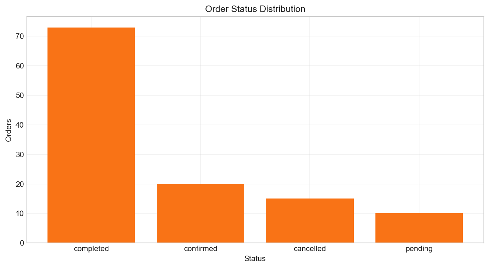

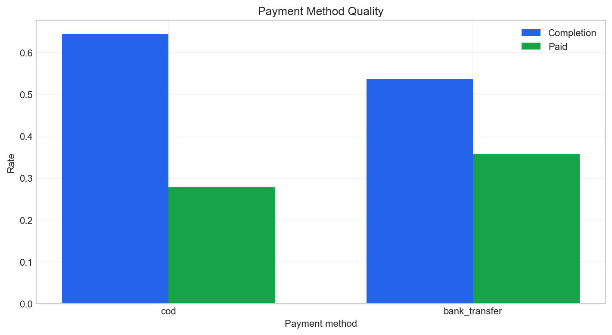

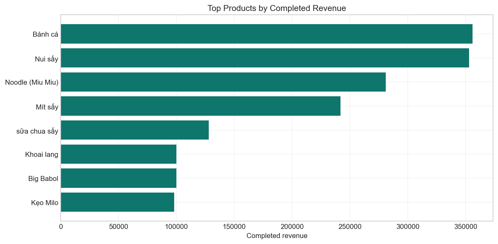

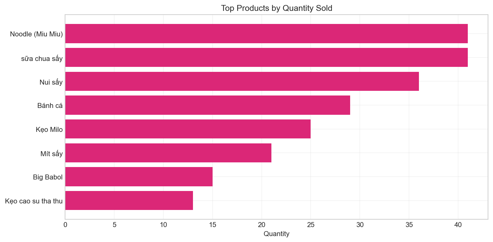

### Order Status

| status | Orders | GMV | OrderShare | GMVShare |
| --- | --- | --- | --- | --- |
| completed | 73 | 3,837,000 VND | 61.9% | 63.8% |
| confirmed | 20 | 899,000 VND | 16.9% | 14.9% |
| cancelled | 15 | 991,000 VND | 12.7% | 16.5% |
| pending | 10 | 290,000 VND | 8.5% | 4.8% |

### Payment Method Quality

| paymentMethod | Orders | CompletedOrders | PaidOrders | GMV | CompletionRate | PaidRate | AOV |
| --- | --- | --- | --- | --- | --- | --- | --- |
| cod | 90 | 58 | 25 | 4,892,000 VND | 64.4% | 27.8% | 54,356 VND |
| bank_transfer | 28 | 15 | 10 | 1,125,000 VND | 53.6% | 35.7% | 40,179 VND |

### Payment Status

| paymentStatus | Orders | GMV | OrderShare |
| --- | --- | --- | --- |
| unpaid | 48 | 2,002,000 VND | 40.7% |
| paid | 35 | 2,473,000 VND | 29.7% |
| unknown | 35 | 1,542,000 VND | 29.7% |

### Product Performance

| Product | Orders | Quantity | Revenue | CompletedQuantity | CompletedRevenue | AveragePrice | RevenueShare | CumulativeRevenueShare |
| --- | --- | --- | --- | --- | --- | --- | --- | --- |
| Bánh cá | 22 | 29 | 576,000 VND | 18 | 356,000 VND | 19,909 VND | 20.6% | 20.6% |
| Nui sấy | 28 | 36 | 850,000 VND | 15 | 353,000 VND | 23,714 VND | 20.4% | 41.0% |
| Noodle (Miu Miu) | 31 | 41 | 691,000 VND | 17 | 281,000 VND | 17,129 VND | 16.3% | 57.3% |
| Mít sấy | 16 | 21 | 634,000 VND | 8 | 242,000 VND | 30,250 VND | 14.0% | 71.3% |
| sữa chua sấy | 24 | 41 | 327,000 VND | 16 | 128,000 VND | 7,958 VND | 7.4% | 78.7% |
| Big Babol | 10 | 15 | 150,000 VND | 10 | 100,000 VND | 10,000 VND | 5.8% | 84.5% |
| Khoai lang | 4 | 4 | 100,000 VND | 4 | 100,000 VND | 25,000 VND | 5.8% | 90.3% |
| Kẹo Milo | 20 | 25 | 350,000 VND | 7 | 98,000 VND | 14,000 VND | 5.7% | 95.9% |
| Kẹo cao su tha thu | 8 | 13 | 130,000 VND | 5 | 50,000 VND | 10,000 VND | 2.9% | 98.8% |
| Bánh cä | 4 | 5 | 100,000 VND | 1 | 20,000 VND | 20,000 VND | 1.2% | 100.0% |

## 9) Recommended Action Plan

| Trigger | Action |
| --- | --- |
| Weekly traffic drop >20% | Review social posting cadence, ad spend, referral links, and product messages within 24 hours. |
| Views/visitor below 1.3 | Improve internal links, product recommendations, and clearer calls to action. |
| Paid rate below 50% | Send payment reminders, clarify bank transfer instructions, and separate unpaid COD from bank transfer issues. |
| Returning customer rate below 30% | Create a retention offer, bundle, or post-purchase message to encourage second orders. |
| Facebook dominates referrals | Use UTM links for every Facebook post so the next report can connect posts to visits and orders. |
| Mobile share above 50% | Prioritize mobile page speed, checkout clarity, and first-screen product information. |
| Top country concentration above 75% | Focus copy, shipping, payment information, and customer support for the main market first. |

## 10) Periodic Tracking Plan

| Timing | Tracking activity | Metrics |
| --- | --- | --- |
| Every Monday | Update weekly KPI table | Visitors, page views, orders, completed GMV, conversion, paid rate |
| Mid-week | Check acquisition health | Referral/channel traffic, Facebook link performance, search traffic |
| After each campaign post | Track campaign effect | Traffic spike, orders, completed orders, revenue per visitor |
| Weekly | Review retention | Returning customers, repeat orders, returning customer GMV share |
| Before next campaign | Review product and payment issues | Top products, cancelled orders, unpaid orders, payment method quality |

## 11) Data Notes and Limitations

- Daily traffic source: `total-data/Bong Lem Analytics Data - Visitor_viewer.csv`
- Base year used for month/day traffic labels: 2026
- Visitor fallback rows fixed from the second numeric column: 24
- Empty future/no-data traffic rows ignored: 59
- Referral, country, device, and operating system exports are aggregate-level data, so they explain traffic mix but cannot directly attribute each order to a visitor source.
- Order conversion is estimated by comparing total campaign orders with total campaign visitors, not by user-level tracking.
